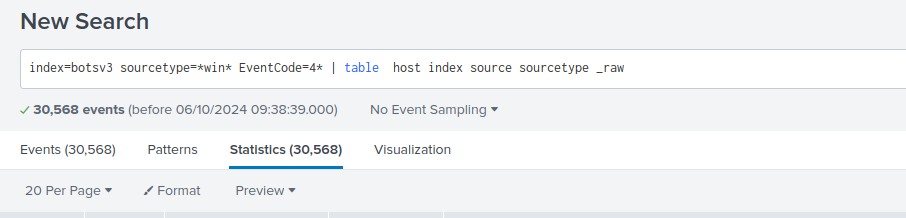
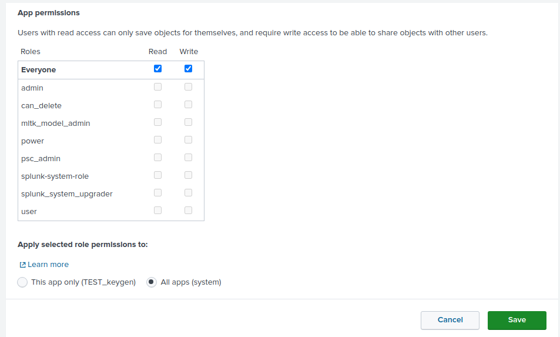
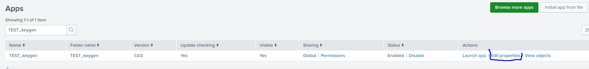
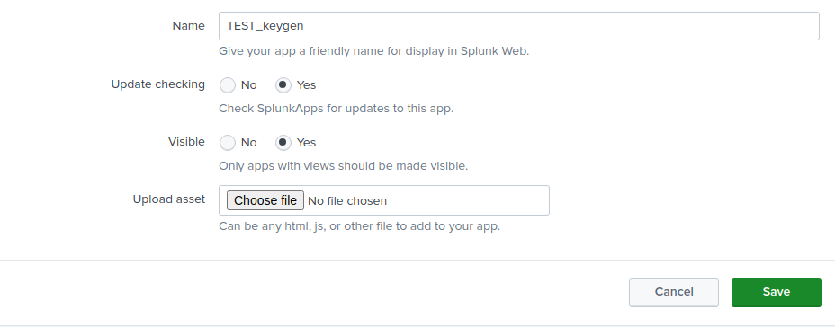
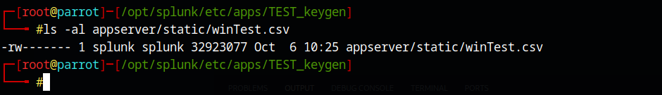

## Create sample 

| table  host index source sourcetype _raw




## To disable / enable source in the eventgen

http://localhost:8000/en-GB/manager/search/data/inputs/modinput_eventgen

## Refresh keygen 

http://localhost:8000/en-GB/debug/refresh?entity=admin/conf-eventgen


## Create App

### Set permission
 

### Crate samples folder

```
mkdir samples
```

### you can download files to /appserver/static 

Download via GUI


 


 


Watch to permission of the file 

example:

 


